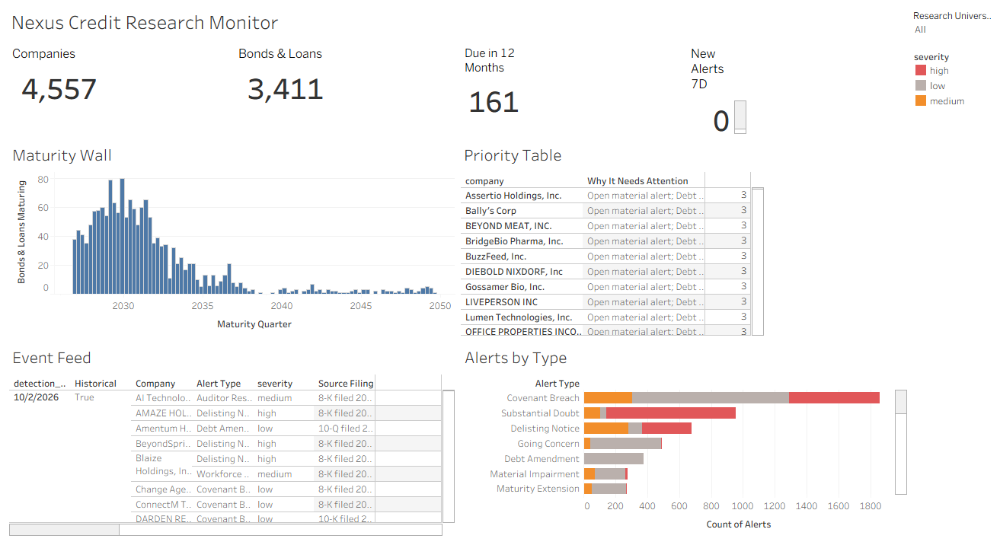

# Nexus Credit Research Monitor

A credit **portfolio-surveillance dashboard** built in Tableau on top of a live PostgreSQL credit-research database.

**Business question:** *Which issuers need attention, what changed, and which debt instruments are affected?*



---

## What it shows

| Panel | Answers |
|---|---|
| **KPI cards** | Coverage at a glance: 4,557 issuers · 3,411 bonds & loans · 161 maturing in 12 months · new material alerts (7 days) |
| **Maturity Wall** | When debt comes due, by quarter (peak in 2028–2031) |
| **Priority Table** | Which issuers need attention first, with *transparent reasons* rather than an invented risk score |
| **Event Feed** | Recent credit events (going-concern doubt, covenant breach, delisting notice, Chapter 11, …) with severity and source filing |
| **Research Universe filter** | View one research group at a time (Distressed Core, High Yield, Fallen Angels, Refinancing Risk, …) |

**Interactions**
- Click an issuer in the Priority Table to filter the Maturity Wall and Event Feed to that issuer.
- Click an alert to open the **original SEC or court filing** it came from (full data provenance).

## Data source

The data comes from **Nexus Credit Intelligence**, a credit-research platform (FastAPI + Supabase PostgreSQL) that ingests public data from SEC EDGAR, OpenFIGI, FRED and CourtListener. All Nexus tables live in a dedicated `nexus` schema inside a shared Supabase project.

The tables used:

| Table | Role |
|---|---|
| `nexus.issuer` | Companies being researched |
| `nexus.security` | Bonds, loans and SEC aggregate debt records |
| `nexus.collection` / `nexus.collection_membership` | Research Universes (many-to-many with issuers) |
| `nexus.alert_event` / `nexus.research_evidence` | Detected credit events and their supporting evidence |
| `nexus.research_note` | Analyst research activity |
| `nexus.provenance` | Source, as-of date and retrieval time for every fact |

See [`docs/nexus-dashboard-data-map.md`](docs/nexus-dashboard-data-map.md) for the full schema, keys, relationships and coverage.

## Approach

```
PostgreSQL (nexus schema)
   ↓  read-only SQL datasets, one grain each (sql/01–04)
Tableau relationships on issuer_id   (no physical joins, no double-counting)
   ↓
KPIs · Maturity Wall · Priority Table · Event Feed
   ↓
Reconciliation queries (sql/07–10) to validate every number
```

**Design decisions**
- **One grain per dataset:** issuer, instrument, issuer–universe pair, alert. Child tables are pre-aggregated before joining, so securities × memberships × alerts never multiply.
- **Instruments vs aggregates:** SEC XBRL "total long-term debt" rows are balance-sheet totals, not bonds. They're classified separately and never charted as instruments.
- **Counts, not dollars:** the source has no currency field and real instrument rows carry no outstanding amount, so the maturity wall uses instrument counts and states that limitation.
- **Synthetic data excluded:** demo records are filtered out everywhere.
- **Alert semantics follow the source app:** dismissed alerts, third-party attributions and historical backfill are excluded from "new material alerts".
- **Membership ≠ condition:** universe membership is research coverage, not proof of financial distress. Conclusions require dated evidence.
- **Extracts:** the dashboard runs on a Tableau extract, so it doesn't query production on every click.

## Validation highlights

- Every KPI was reconciled to source table counts (e.g. 4,557 issuers = 4,557 rows).
- **A zero that wasn't a bug:** "New material alerts (7d)" showed 0. Investigation showed 97% of 6,410 alerts were historical backfill, and the last new detection was 16 days old, so the zero was real and pointed to a pipeline-freshness question.
- **Coverage gap found:** 1,915 issuers (42%) belong to no research universe, yet 75 of their instruments mature within 12 months.
- **Type-mismatch fix:** cross-table filtering failed with `text = uuid`; fixed by standardizing `issuer_id` as text in all datasets.

Details: [`docs/nexus-dashboard-validation.md`](docs/nexus-dashboard-validation.md)

## Repository contents

```
sql/
  01_issuer_dataset.sql                 issuer grain: KPIs, priority reasons
  02_instrument_dataset.sql             instrument grain: maturity wall
  03_universe_membership_dataset.sql    issuer–universe grain: universe filter
  04_alert_dataset.sql                  alert grain: event feed, evidence links
  05_data_completeness.sql              field-coverage profile
  06_ingestion_freshness.sql            provider freshness and pipeline status
  07–09_*_reference.sql                 independent KPI reconciliation
  10_validation_checks.sql              duplicates, orphans, date anomalies
docs/
  nexus-dashboard-data-map.md           schema, relationships, coverage
  nexus-dashboard-build-guide.md        step-by-step Tableau build
  nexus-dashboard-validation.md         checks performed and results
images/
  dashboard.png                         dashboard screenshot
```

## Tools

Tableau Desktop · PostgreSQL (Supabase) · SQL (CTEs, pre-aggregation, `FILTER` clauses, `DISTINCT ON`, JSONB, lateral joins)

## Roadmap

- [x] MVP: KPIs, maturity wall, priority table
- [x] V2: event feed, issuer drilldown, SEC source links, research-universe filter, extract
- [x] V2.1: severity color-coding, alerts-by-type chart, click-to-filter by alert type
- [ ] Data Quality and Freshness page (datasets 05–06)
- [ ] Scheduled extract refresh

---

*Built by Sukumar Chigurupati. Data source: Nexus Credit Intelligence by Kiran (`kirantoday/nexus-credit-intelligence`), used with permission. All issuer data is derived from public SEC EDGAR and court filings.*
